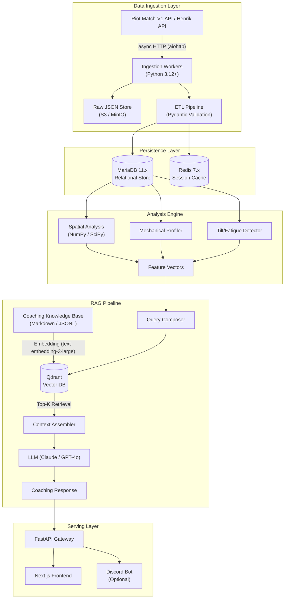
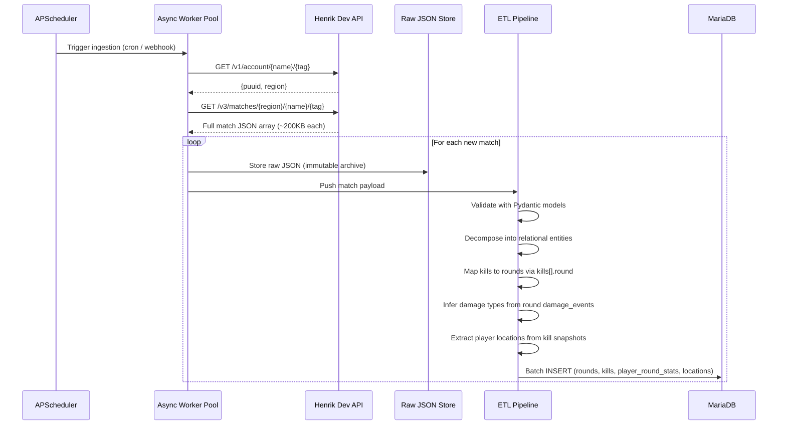
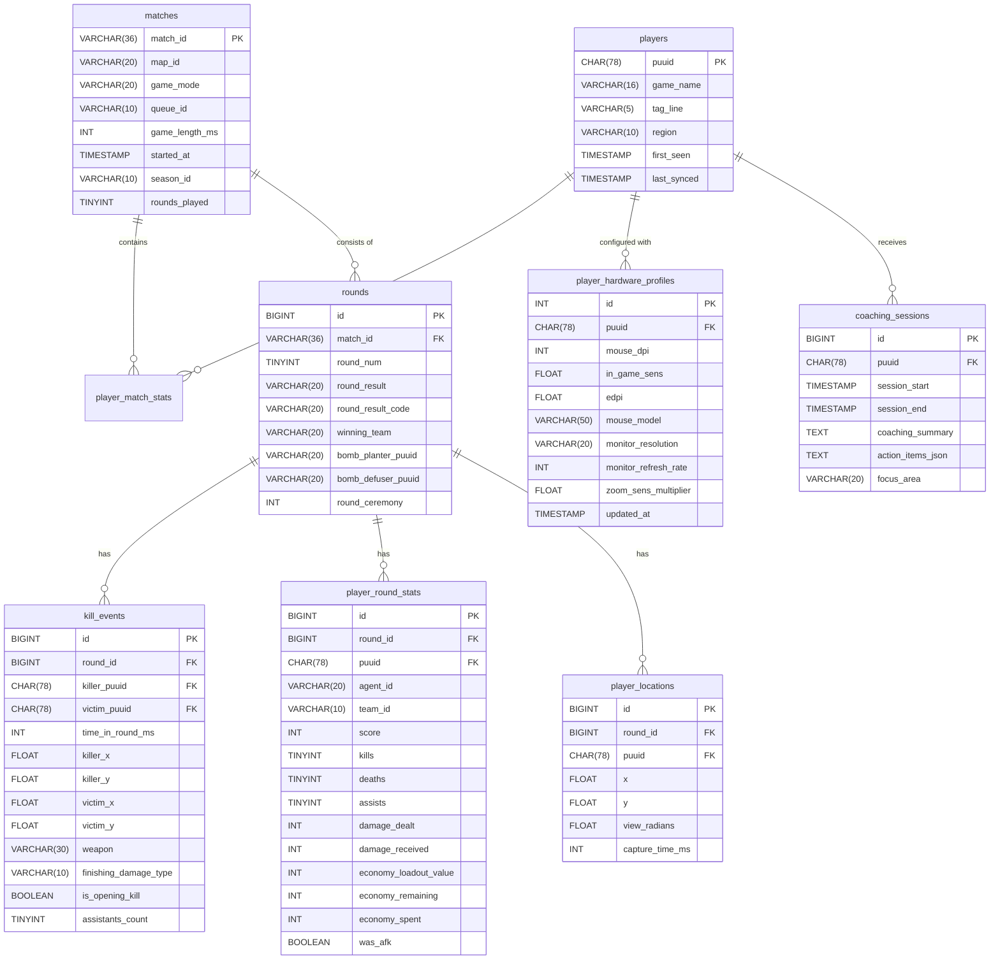
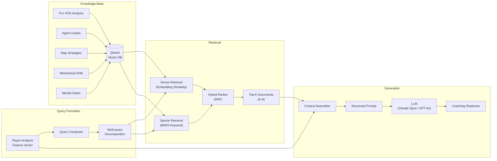
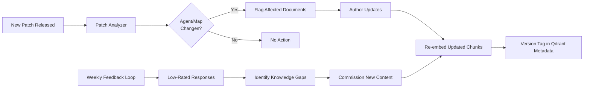
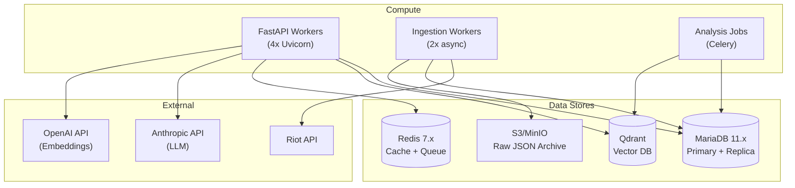

# ONETAP AI — System Architecture & Technical Blueprint

> **Version:** 1.0.0 · **Classification:** Internal Engineering Spec  
> **Last Updated:** 2026-07-04  
> **Authors:** Systems Architecture Team

---

## Table of Contents

1. [Executive Summary](#1-executive-summary)
2. [High-Level System Architecture](#2-high-level-system-architecture)
3. [Data Ingestion Pipeline](#3-data-ingestion-pipeline)
4. [MariaDB Relational Schema](#4-mariadb-relational-schema)
5. [Spatial & Geometric Analysis Engine](#5-spatial--geometric-analysis-engine)
6. [Mechanical Analysis Subsystem](#6-mechanical-analysis-subsystem)
7. [Tilt & Fatigue Detection Module](#7-tilt--fatigue-detection-module)
8. [RAG Implementation Strategy](#8-rag-implementation-strategy)
9. [Knowledge Sourcing Strategy](#9-knowledge-sourcing-strategy)
10. [LLM Orchestration & Prompt Engineering](#10-llm-orchestration--prompt-engineering)
11. [API Layer & Frontend Contract](#11-api-layer--frontend-contract)
12. [Phased Development Roadmap](#12-phased-development-roadmap)
13. [Infrastructure & Deployment](#13-infrastructure--deployment)
14. [Appendices](#14-appendices)

---

## 1. Executive Summary

**OneTap AI** is a hyper-personalized Valorant coaching platform that moves beyond surface-level stat aggregation into **causal gameplay analysis**. By combining round-granular match data from Riot's APIs (or Henrik Dev's unofficial Valorant API), spatial coordinate geometry, hardware-aware mechanical profiling, and a Retrieval-Augmented Generation (RAG) pipeline backed by curated coaching knowledge, the system delivers coach-tier insights that are contextual, actionable, and adaptive.

### What Makes This Different

| Existing Tools (Tracker.gg, Blitz) | OneTap AI |
|---|---|
| Aggregate K/D/A, win rate | Per-round ACS variance decomposition |
| Generic "you died here" heatmaps | Geometric peek-angle classification (wide swing vs. jiggle vs. crossfire entry) |
| No mechanical root-cause analysis | Body-shot ratio → crosshair placement error correlation with hardware-calibrated drill prescriptions |
| No temporal/psychological dimension | Tilt detection via session-level ACS degradation curves + match frequency analysis |
| Static tips | RAG-powered coaching responses grounded in pro-level VOD analysis, agent-specific meta, and map geometry |

---

## 2. High-Level System Architecture



### Component Responsibilities

| Component | Technology | Purpose |
|---|---|---|
| **Ingestion Workers** | Python 3.12+, `aiohttp`, `asyncio` | Rate-limited async polling of Henrik Dev API |
| **ETL Pipeline** | Pydantic v2, custom transformers | Validate, normalize, and decompose raw match JSON |
| **Relational Store** | MariaDB 11.x (InnoDB) | Structured match/round/event storage with spatial indexing |
| **Session Cache** | Redis 7.x | Active session state, rate limit counters, intermediate computations |
| **Analysis Engine** | NumPy, SciPy, scikit-learn | Spatial geometry, statistical profiling, anomaly detection |
| **Vector DB** | Qdrant (self-hosted) | Semantic search over coaching knowledge corpus |
| **LLM Orchestration** | LangChain / LlamaIndex | Prompt composition, retrieval chaining, response generation |
| **API Gateway** | FastAPI 0.110+ | REST/WebSocket API with Pydantic response models |
| **Frontend** | Next.js 15 (App Router) | Interactive dashboard, map overlays, coaching chat |

---

## 3. Data Ingestion Pipeline

### 3.1 API Integration Architecture

**Option A: Official Riot API Strategy**
Riot's API ecosystem requires orchestrating multiple endpoints to assemble a complete analytical picture:

```
Match History Flow:
  account-v1/by-riot-id → puuid
  → val-match-v1/matchlists/by-puuid → matchId[]
  → val-match-v1/matches/{matchId} → Full Match JSON
```

**Option B: Henrik Dev Unofficial API (Current Implementation)**
Henrik Dev's API simplifies fetching by wrapping Riot's complex endpoints into a cleaner v3 structure:

```
Match History Flow:
  v1/account/{name}/{tag} → region, puuid
  → v3/matches/{region}/{name}/{tag} → Full Match JSON array
```

### 3.2 Async Worker Implementation

```python
# ingestion/worker.py — Core async ingestion loop (Henrik Dev API)

import asyncio
import aiohttp
from dataclasses import dataclass

@dataclass(frozen=True)
class RateLimitConfig:
    """Henrik Dev API rate limits: 30 req/min (free tier), adjust based on your plan."""
    requests_per_second: int = 18        # 90% of limit for safety margin
    requests_per_2min: int = 95
    retry_base_delay: float = 1.0
    retry_max_delay: float = 60.0
    retry_max_attempts: int = 5

class HenrikAPIClient:
    def __init__(self, api_key: str, config: RateLimitConfig):
        self._api_key = api_key
        self._base_url = "https://api.henrikdev.xyz"
        self._config = config
        self._semaphore = asyncio.Semaphore(config.requests_per_second)
        self._session: aiohttp.ClientSession | None = None

    async def _request(self, url: str) -> dict:
        """Rate-limited request with exponential backoff on 429s."""
        if self._session is None or self._session.closed:
            self._session = aiohttp.ClientSession(
                headers={"Authorization": self._api_key}
            )

        async with self._semaphore:
            for attempt in range(self._config.retry_max_attempts):
                async with self._session.get(url) as resp:
                    if resp.status == 200:
                        return await resp.json()
                    elif resp.status == 429:
                        retry_after = float(
                            resp.headers.get("Retry-After", self._config.retry_base_delay)
                        )
                        delay = min(
                            retry_after * (2 ** attempt),
                            self._config.retry_max_delay
                        )
                        await asyncio.sleep(delay)
                    else:
                        resp.raise_for_status()
            raise RuntimeError(f"Exhausted retries for {url}")

    async def get_account(self, name: str, tag: str) -> dict:
        """Fetch account info to get PUUID and region."""
        url = f"{self._base_url}/valorant/v1/account/{name}/{tag}"
        data = await self._request(url)
        return data["data"]

    async def get_matches(
        self, region: str, name: str, tag: str, size: int = 5
    ) -> list[dict]:
        """Fetch latest matches for a player (Henrik v3 returns full match payloads)."""
        url = f"{self._base_url}/valorant/v3/matches/{region}/{name}/{tag}?size={size}"
        data = await self._request(url)
        return data.get("data", [])

    async def close(self):
        """Close the underlying aiohttp session."""
        if self._session and not self._session.closed:
            await self._session.close()
```

### 3.3 ETL & Validation Layer

The ETL pipeline adapts based on the API source. Pydantic models enforce structural contracts.

**Data Refactoring Comparison (Riot vs Henrik):**

| Data Component | Official Riot API Path | Henrik Dev API Path |
| --- | --- | --- |
| **Match Metadata** | `matchInfo.matchId` | `metadata.matchid` |
| **Map / Mode** | `matchInfo.mapId`, `matchInfo.gameMode` | `metadata.map`, `metadata.mode` |
| **Game Timing** | `matchInfo.gameLengthMillis` | `metadata.game_length` (seconds), `metadata.game_start` (unix) |
| **Season** | `matchInfo.seasonId` | `metadata.season_id` |
| **Players** | `players` (Root array) | `players.all_players` (nested dict with `red`, `blue`, `all_players`) |
| **Player Agent** | `players[].characterId` | `players.all_players[].character` (display name, not UUID) |
| **Player Stats** | `players[].stats` | `players.all_players[].stats` (`score`, `kills`, `deaths`, `assists`, `headshots`, `bodyshots`, `legshots`) |
| **Rounds** | `roundResults` | `rounds` (array with `winning_team`, `end_type`, `bomb_planted`, `player_stats`) |
| **Round Player Stats** | `roundResults[].playerStats[]` | `rounds[].player_stats[]` (per-player: `score`, `kills`, `damage`, `headshots`, `bodyshots`, `legshots`, `economy`, `was_afk`, `was_penalized`) |
| **Round Economy** | `roundResults[].playerStats[].economy` | `rounds[].player_stats[].economy` (`loadout_value`, `remaining`, `spent`, `weapon`, `armor`) |
| **Kill Events** | Nested inside `roundResults.playerStats.kills` | `kills` (Global array at root, each with `round` field for round number) |
| **Kill Round Number** | Derived from parent `roundResult` index | `kills[].round` (0-indexed integer) |
| **Killer Location (X/Y)** | `killerLocation.x`, `killerLocation.y` | `kills[].player_locations_on_kill[]` → find entry where `player_puuid == killer_puuid` → `.location.x`, `.location.y` |
| **Victim Location (X/Y)** | `victimLocation.x`, `victimLocation.y` | `kills[].victim_death_location.x`, `.y` |
| **Weapon** | Kill event weapon field | `kills[].damage_weapon_id` (UUID), `kills[].damage_weapon_name` (display name) |
| **Finishing Damage Type** | Available per kill event | **Not directly available per kill** — must infer from `rounds[].player_stats[].damage_events[]` which has per-victim `headshots`, `bodyshots`, `legshots` counts |
| **Kill Assistants** | Kill event assistants array | `kills[].assistants[]` (array of `{assistant_puuid, assistant_display_name, assistant_team}`) |
| **Plant/Defuse** | `roundResults` bomb fields | `rounds[].plant_events` (`planted_by.puuid`, `plant_site`, `plant_time_in_round`), `rounds[].defuse_events` (`defused_by.puuid`, `defuse_time_in_round`) |
| **Player Locations** | Per-round location snapshots | Available inside `kills[].player_locations_on_kill[]` (all 10 player positions at moment of each kill, with `view_radians`) |
| **Teams / Win** | Match result data | `teams.red.has_won`, `teams.blue.has_won`, `.rounds_won`, `.rounds_lost` |

> [!IMPORTANT]
> **Henrik API kill events do NOT include `finishing_damage_type` (headshot/bodyshot/legshot).** This must be inferred from `rounds[].player_stats[].damage_events[]` which provides per-victim hit distribution, or computed from the match-level `players.all_players[].stats.headshots/bodyshots/legshots` for aggregate stats.

*Note: Raw Riot JSON is deeply nested and inconsistent across game versions, requiring recursive loops to find events. Henrik Dev JSON flattens global `kills` into a single root array with a `round` field, significantly reducing Big O complexity during ETL parsing. However, Henrik lacks per-kill damage type classification, requiring cross-referencing with round-level damage events.*

```python
# ingestion/models.py — Pydantic validation models

from pydantic import BaseModel, Field, field_validator
from enum import StrEnum

class DamageType(StrEnum):
    HEADSHOT = "headshot"
    BODYSHOT = "bodyshot"
    LEGSHOT = "legshot"

class KillEvent(BaseModel):
    """A single kill within a round."""
    killer_puuid: str
    victim_puuid: str
    round_num: int = Field(ge=0, le=24)
    time_in_round_ms: int = Field(ge=0)
    killer_x: float            # Map-space X coordinate
    killer_y: float            # Map-space Y coordinate
    victim_x: float
    victim_y: float
    finishing_damage_type: DamageType
    weapon: str
    assistants: list[str] = Field(default_factory=list)

class PlayerRoundStats(BaseModel):
    """Per-round stats for a single player."""
    puuid: str
    round_num: int
    score: int                 # ACS contribution for this round
    kills: int
    deaths: int
    assists: int
    damage_dealt: int
    damage_received: int
    economy_loadout_value: int # Creds spent on loadout
    economy_remaining: int
    economy_spent: int
    was_afk: bool = False
    was_penalized: bool = False

    @field_validator("score")
    @classmethod
    def score_non_negative(cls, v: int) -> int:
        if v < 0:
            raise ValueError("Round score cannot be negative")
        return v

class PlayerLocation(BaseModel):
    """Snapshot of player position during a round."""
    puuid: str
    round_num: int
    view_radians: float        # Where they're looking (yaw)
    x: float
    y: float
```

### 3.4 Data Flow Diagram



---

## 4. MariaDB Relational Schema

### 4.1 Design Principles

- **Round-granular normalization**: Every stat is stored per-round, not aggregated per-match.
- **Spatial columns**: `FLOAT` for X/Y map coordinates. These are **raw Unreal-engine world units — large signed values** (observed range roughly −9500..+8300), NOT a normalized 0–1024 grid. See §5.1. Normalize per-map at analysis time.
- **Economy-aware**: Full loadout values per round for eco/force-buy/full-buy classification.
- **Temporal indexing**: Composite indexes on `(player_puuid, match_started_at)` for session-level queries.

### 4.2 Entity-Relationship Diagram



### 4.3 Full DDL

```sql
-- ================================================================
-- OneTap AI — MariaDB Schema
-- Engine: InnoDB | Charset: utf8mb4 | Collation: utf8mb4_unicode_ci
-- ================================================================

CREATE DATABASE IF NOT EXISTS onetapai
    CHARACTER SET utf8mb4
    COLLATE utf8mb4_unicode_ci;

USE onetapai;

-- ----------------------------------------------------------------
-- Core Entity Tables
-- ----------------------------------------------------------------

CREATE TABLE players (
    puuid           CHAR(78)        NOT NULL,
    game_name       VARCHAR(16)     NOT NULL,
    tag_line        VARCHAR(5)      NOT NULL,
    region          VARCHAR(10)     NOT NULL DEFAULT 'na',
    first_seen      TIMESTAMP       NOT NULL DEFAULT CURRENT_TIMESTAMP,
    last_synced     TIMESTAMP       NULL,
    PRIMARY KEY (puuid),
    INDEX idx_players_gamename (game_name, tag_line)
) ENGINE=InnoDB;

CREATE TABLE matches (
    match_id        VARCHAR(36)     NOT NULL,
    map_id          VARCHAR(20)     NOT NULL,
    game_mode       VARCHAR(20)     NOT NULL,
    queue_id        VARCHAR(10)     NULL,
    game_length_ms  INT UNSIGNED    NOT NULL,
    started_at      TIMESTAMP       NOT NULL,
    season_id       VARCHAR(10)     NULL,
    rounds_played   TINYINT UNSIGNED NOT NULL,
    PRIMARY KEY (match_id),
    INDEX idx_matches_started (started_at),
    INDEX idx_matches_map (map_id, started_at)
) ENGINE=InnoDB;

CREATE TABLE player_match_stats (
    id              BIGINT UNSIGNED NOT NULL AUTO_INCREMENT,
    match_id        VARCHAR(36)     NOT NULL,
    puuid           CHAR(78)        NOT NULL,
    team_id         VARCHAR(10)     NOT NULL,
    agent_id        VARCHAR(20)     NOT NULL,
    -- Match-level aggregates (derived, but cached for fast reads)
    total_score     INT UNSIGNED    NOT NULL DEFAULT 0,
    total_rounds    TINYINT UNSIGNED NOT NULL DEFAULT 0,
    acs             FLOAT           GENERATED ALWAYS AS (
                        CASE WHEN total_rounds > 0
                             THEN total_score / total_rounds
                             ELSE 0 END
                    ) STORED,
    total_kills     SMALLINT UNSIGNED NOT NULL DEFAULT 0,
    total_deaths    SMALLINT UNSIGNED NOT NULL DEFAULT 0,
    total_assists   SMALLINT UNSIGNED NOT NULL DEFAULT 0,
    headshot_pct    FLOAT           NULL,
    bodyshot_pct    FLOAT           NULL,
    legshot_pct     FLOAT           NULL,
    won             BOOLEAN         NOT NULL,
    PRIMARY KEY (id),
    UNIQUE KEY uk_match_player (match_id, puuid),
    INDEX idx_pms_puuid_time (puuid),
    CONSTRAINT fk_pms_match FOREIGN KEY (match_id) REFERENCES matches(match_id),
    CONSTRAINT fk_pms_player FOREIGN KEY (puuid) REFERENCES players(puuid)
) ENGINE=InnoDB;

CREATE TABLE rounds (
    id              BIGINT UNSIGNED NOT NULL AUTO_INCREMENT,
    match_id        VARCHAR(36)     NOT NULL,
    round_num       TINYINT UNSIGNED NOT NULL,
    round_result    VARCHAR(20)     NOT NULL,
    round_result_code VARCHAR(20)   NULL,
    winning_team    VARCHAR(10)     NOT NULL,
    bomb_planter    CHAR(78)        NULL,
    bomb_defuser    CHAR(78)        NULL,
    plant_time_ms   INT UNSIGNED    NULL,
    defuse_time_ms  INT UNSIGNED    NULL,
    PRIMARY KEY (id),
    UNIQUE KEY uk_match_round (match_id, round_num),
    INDEX idx_rounds_match (match_id),
    CONSTRAINT fk_rounds_match FOREIGN KEY (match_id) REFERENCES matches(match_id)
) ENGINE=InnoDB;

-- ----------------------------------------------------------------
-- Spatial & Event Tables (Core of the Analysis Engine)
-- ----------------------------------------------------------------

CREATE TABLE kill_events (
    id                  BIGINT UNSIGNED NOT NULL AUTO_INCREMENT,
    round_id            BIGINT UNSIGNED NOT NULL,
    killer_puuid        CHAR(78)        NOT NULL,
    victim_puuid        CHAR(78)        NOT NULL,
    time_in_round_ms    INT UNSIGNED    NOT NULL,
    -- Spatial coordinates: raw Unreal world units, large signed values (NOT 0-1024)
    killer_x            FLOAT           NOT NULL,
    killer_y            FLOAT           NOT NULL,
    victim_x            FLOAT           NOT NULL,
    victim_y            FLOAT           NOT NULL,
    -- Engagement metadata
    weapon              VARCHAR(30)     NOT NULL,
    finishing_damage_type VARCHAR(10)   NOT NULL COMMENT 'headshot|bodyshot|legshot',
    is_opening_kill     BOOLEAN         NOT NULL DEFAULT FALSE,
    assistants_count    TINYINT UNSIGNED NOT NULL DEFAULT 0,
    -- Derived: Euclidean engagement distance
    engagement_distance FLOAT           GENERATED ALWAYS AS (
                            SQRT(
                                POW(killer_x - victim_x, 2) +
                                POW(killer_y - victim_y, 2)
                            )
                        ) STORED,
    -- Derived: Engagement angle (radians from X-axis)
    engagement_angle    FLOAT           GENERATED ALWAYS AS (
                            ATAN2(victim_y - killer_y, victim_x - killer_x)
                        ) STORED,
    PRIMARY KEY (id),
    INDEX idx_ke_round (round_id),
    INDEX idx_ke_killer (killer_puuid, time_in_round_ms),
    INDEX idx_ke_victim (victim_puuid),
    INDEX idx_ke_spatial_killer (killer_x, killer_y),
    INDEX idx_ke_spatial_victim (victim_x, victim_y),
    INDEX idx_ke_opening (is_opening_kill, killer_puuid),
    CONSTRAINT fk_ke_round FOREIGN KEY (round_id) REFERENCES rounds(id)
) ENGINE=InnoDB;

CREATE TABLE player_round_stats (
    id                  BIGINT UNSIGNED NOT NULL AUTO_INCREMENT,
    round_id            BIGINT UNSIGNED NOT NULL,
    puuid               CHAR(78)        NOT NULL,
    agent_id            VARCHAR(20)     NOT NULL,
    team_id             VARCHAR(10)     NOT NULL,
    score               INT UNSIGNED    NOT NULL DEFAULT 0,
    kills               TINYINT UNSIGNED NOT NULL DEFAULT 0,
    deaths              TINYINT UNSIGNED NOT NULL DEFAULT 0,
    assists             TINYINT UNSIGNED NOT NULL DEFAULT 0,
    damage_dealt        INT UNSIGNED    NOT NULL DEFAULT 0,
    damage_received     INT UNSIGNED    NOT NULL DEFAULT 0,
    economy_loadout_value INT UNSIGNED  NOT NULL DEFAULT 0,
    economy_remaining   INT UNSIGNED    NOT NULL DEFAULT 0,
    economy_spent       INT UNSIGNED    NOT NULL DEFAULT 0,
    was_afk             BOOLEAN         NOT NULL DEFAULT FALSE,
    was_penalized       BOOLEAN         NOT NULL DEFAULT FALSE,
    PRIMARY KEY (id),
    UNIQUE KEY uk_round_player (round_id, puuid),
    INDEX idx_prs_puuid (puuid, round_id),
    INDEX idx_prs_agent (agent_id, puuid),
    INDEX idx_prs_economy (economy_loadout_value),
    CONSTRAINT fk_prs_round FOREIGN KEY (round_id) REFERENCES rounds(id),
    CONSTRAINT fk_prs_player FOREIGN KEY (puuid) REFERENCES players(puuid)
) ENGINE=InnoDB;

CREATE TABLE player_locations (
    id                  BIGINT UNSIGNED NOT NULL AUTO_INCREMENT,
    round_id            BIGINT UNSIGNED NOT NULL,
    puuid               CHAR(78)        NOT NULL,
    x                   FLOAT           NOT NULL,
    y                   FLOAT           NOT NULL,
    view_radians        FLOAT           NOT NULL COMMENT 'Yaw direction player is facing',
    capture_time_ms     INT UNSIGNED    NOT NULL COMMENT 'Timestamp within the round',
    PRIMARY KEY (id),
    INDEX idx_pl_round_player (round_id, puuid),
    INDEX idx_pl_spatial (x, y),
    CONSTRAINT fk_pl_round FOREIGN KEY (round_id) REFERENCES rounds(id)
) ENGINE=InnoDB;

-- ----------------------------------------------------------------
-- Player Configuration & Hardware
-- ----------------------------------------------------------------

CREATE TABLE player_hardware_profiles (
    id                  INT UNSIGNED    NOT NULL AUTO_INCREMENT,
    puuid               CHAR(78)        NOT NULL,
    mouse_dpi           INT UNSIGNED    NOT NULL DEFAULT 800,
    in_game_sens        FLOAT           NOT NULL DEFAULT 0.5,
    edpi                FLOAT           GENERATED ALWAYS AS (mouse_dpi * in_game_sens) STORED,
    mouse_model         VARCHAR(50)     NULL,
    monitor_resolution  VARCHAR(20)     NULL DEFAULT '1920x1080',
    monitor_refresh_rate INT UNSIGNED   NULL DEFAULT 144,
    zoom_sens_multiplier FLOAT          NOT NULL DEFAULT 1.0,
    updated_at          TIMESTAMP       NOT NULL DEFAULT CURRENT_TIMESTAMP
                                            ON UPDATE CURRENT_TIMESTAMP,
    PRIMARY KEY (id),
    UNIQUE KEY uk_hw_puuid (puuid),
    CONSTRAINT fk_hw_player FOREIGN KEY (puuid) REFERENCES players(puuid)
) ENGINE=InnoDB;

-- ----------------------------------------------------------------
-- Coaching & Session Tracking
-- ----------------------------------------------------------------

CREATE TABLE coaching_sessions (
    id                  BIGINT UNSIGNED NOT NULL AUTO_INCREMENT,
    puuid               CHAR(78)        NOT NULL,
    session_start       TIMESTAMP       NOT NULL,
    session_end         TIMESTAMP       NULL,
    focus_area          VARCHAR(30)     NULL COMMENT 'aim|positioning|economy|mental|utility',
    coaching_summary    TEXT            NULL,
    action_items_json   JSON            NULL,
    matches_analyzed    JSON            NULL COMMENT 'Array of match_ids covered',
    PRIMARY KEY (id),
    INDEX idx_cs_puuid (puuid, session_start),
    CONSTRAINT fk_cs_player FOREIGN KEY (puuid) REFERENCES players(puuid)
) ENGINE=InnoDB;

CREATE TABLE player_sessions (
    id                  BIGINT UNSIGNED NOT NULL AUTO_INCREMENT,
    puuid               CHAR(78)        NOT NULL,
    session_date        DATE            NOT NULL,
    first_match_at      TIMESTAMP       NOT NULL,
    last_match_at       TIMESTAMP       NOT NULL,
    match_count         TINYINT UNSIGNED NOT NULL,
    -- Session-level ACS trajectory for tilt detection
    acs_first_match     FLOAT           NULL,
    acs_last_match      FLOAT           NULL,
    acs_trend_slope     FLOAT           NULL COMMENT 'Linear regression slope across session',
    acs_std_dev         FLOAT           NULL,
    avg_queue_gap_min   FLOAT           NULL COMMENT 'Avg minutes between matches',
    tilt_probability    FLOAT           NULL COMMENT '0.0–1.0 computed tilt score',
    PRIMARY KEY (id),
    UNIQUE KEY uk_session (puuid, session_date),
    INDEX idx_ps_tilt (puuid, tilt_probability),
    CONSTRAINT fk_ps_player FOREIGN KEY (puuid) REFERENCES players(puuid)
) ENGINE=InnoDB;

-- ----------------------------------------------------------------
-- Economy Classification View
-- ----------------------------------------------------------------

CREATE OR REPLACE VIEW v_round_economy_class AS
SELECT
    prs.id AS prs_id,
    prs.round_id,
    prs.puuid,
    prs.economy_loadout_value,
    CASE
        WHEN prs.economy_loadout_value < 2000  THEN 'eco'
        WHEN prs.economy_loadout_value < 3900  THEN 'half_buy'
        WHEN prs.economy_loadout_value < 4500  THEN 'force_buy'
        ELSE 'full_buy'
    END AS economy_class,
    prs.score,
    prs.kills,
    prs.deaths,
    prs.damage_dealt
FROM player_round_stats prs;

-- ----------------------------------------------------------------
-- ACS Variance Analysis View (Feast-or-Famine Detection)
-- ----------------------------------------------------------------

CREATE OR REPLACE VIEW v_player_acs_variance AS
SELECT
    prs.puuid,
    prs.agent_id,
    r.match_id,
    COUNT(*)                    AS rounds_played,
    AVG(prs.score)              AS avg_round_score,
    STDDEV_POP(prs.score)       AS score_stddev,
    VARIANCE(prs.score)         AS score_variance,
    -- Coefficient of variation: high = feast-or-famine
    CASE
        WHEN AVG(prs.score) > 0
        THEN STDDEV_POP(prs.score) / AVG(prs.score)
        ELSE 0
    END                         AS cv_score,
    MAX(prs.score)              AS max_round_score,
    MIN(prs.score)              AS min_round_score,
    MAX(prs.score) - MIN(prs.score) AS score_range
FROM player_round_stats prs
JOIN rounds r ON prs.round_id = r.id
GROUP BY prs.puuid, prs.agent_id, r.match_id;

-- ----------------------------------------------------------------
-- Opening Duel Performance View
-- ----------------------------------------------------------------

CREATE OR REPLACE VIEW v_opening_duel_stats AS
SELECT
    ke.killer_puuid                                         AS puuid,
    'kill'                                                  AS outcome,
    ke.weapon,
    ke.finishing_damage_type,
    ke.engagement_distance,
    ke.killer_x                                             AS player_x,
    ke.killer_y                                             AS player_y,
    ke.time_in_round_ms,
    r.match_id,
    r.round_num
FROM kill_events ke
JOIN rounds r ON ke.round_id = r.id
WHERE ke.is_opening_kill = TRUE

UNION ALL

SELECT
    ke.victim_puuid                                         AS puuid,
    'death'                                                 AS outcome,
    ke.weapon,
    ke.finishing_damage_type,
    ke.engagement_distance,
    ke.victim_x                                             AS player_x,
    ke.victim_y                                             AS player_y,
    ke.time_in_round_ms,
    r.match_id,
    r.round_num
FROM kill_events ke
JOIN rounds r ON ke.round_id = r.id
WHERE ke.is_opening_kill = TRUE;
```

---

## 5. Spatial & Geometric Analysis Engine

### 5.1 Coordinate System

Valorant uses Unreal Engine's coordinate system. The Henrik API returns raw coordinates in this space, which use **large signed values** (not a normalized 0–1024 range):

| Map | X Range (observed) | Y Range (observed) | Notes |
|---|---|---|---|
| Split | -2898 to 7409 | -7094 to -4776 | Y values are negative |
| Ascent | TBD (ingest more data) | TBD | |
| Bind | TBD | TBD | |
| Haven | TBD | TBD | |
| ... | ... | ... | Map geometry data must be calibrated per map |

> [!WARNING]
> The coordinate system uses **Unreal Engine units**, NOT a normalized 0–1024 grid. Real coordinates from Henrik API include large negative values (e.g., `x: -2328, y: -5482`). All map geometry configurations (wall segments, choke points, common angles) must be authored in this native coordinate space.

> [!IMPORTANT]
> Coordinate values must be normalized per-map before cross-map comparisons. We store raw coordinates and apply normalization at query time via map metadata.


### 5.2 Peek Classification Algorithm

This is the core differentiator. We classify how a player entered an engagement based on their death position relative to common geometry:

```python
# analysis/spatial/peek_classifier.py

import numpy as np
from enum import StrEnum
from dataclasses import dataclass

class PeekType(StrEnum):
    WIDE_SWING = "wide_swing"          # Exposed to multiple angles
    TIGHT_PEEK = "tight_peek"          # Close to wall geometry
    JIGGLE_PEEK = "jiggle_peek"        # Minimal exposure (inferred from survival)
    CROSSFIRE_ENTRY = "crossfire_entry" # Died in a multi-angle kill zone
    OFF_ANGLE = "off_angle"            # Unconventional position
    UNKNOWN = "unknown"

@dataclass
class MapGeometry:
    """Pre-computed wall segments and common angle points for a map."""
    wall_segments: np.ndarray   # Shape: (N, 2, 2) — N segments, each [(x1,y1), (x2,y2)]
    choke_points: np.ndarray    # Shape: (M, 2) — known crossfire zones
    common_angles: np.ndarray   # Shape: (K, 2) — common hold positions

    def distance_to_nearest_wall(self, point: np.ndarray) -> float:
        """Minimum perpendicular distance from point to any wall segment."""
        # Vector math: project point onto each segment, clamp, measure distance
        p1 = self.wall_segments[:, 0, :]  # (N, 2)
        p2 = self.wall_segments[:, 1, :]  # (N, 2)
        d = p2 - p1
        # Parameter t along each segment
        t = np.sum((point - p1) * d, axis=1) / (np.sum(d * d, axis=1) + 1e-10)
        t = np.clip(t, 0.0, 1.0)
        projections = p1 + t[:, np.newaxis] * d
        distances = np.linalg.norm(projections - point, axis=1)
        return float(np.min(distances))

    def is_in_crossfire_zone(
        self, point: np.ndarray, threshold: float = 50.0
    ) -> bool:
        """Check if point is within threshold distance of a known crossfire zone."""
        if len(self.choke_points) == 0:
            return False
        distances = np.linalg.norm(self.choke_points - point, axis=1)
        return bool(np.min(distances) < threshold)


def classify_peek(
    death_pos: np.ndarray,         # (x, y) where player died
    killer_pos: np.ndarray,        # (x, y) where killer was
    map_geo: MapGeometry,
    wall_proximity_threshold: float = 30.0,   # units
    crossfire_threshold: float = 50.0,
    wide_swing_angle_threshold: float = 0.5,  # radians (~28.6°)
) -> PeekType:
    """
    Classify the peek type based on death position geometry.

    Heuristics:
    1. If death_pos is in a crossfire zone → CROSSFIRE_ENTRY
    2. If death_pos is close to a wall → TIGHT_PEEK
    3. If death_pos is far from walls AND engagement angle is wide → WIDE_SWING
    4. If death_pos is far from common angles → OFF_ANGLE
    """
    wall_dist = map_geo.distance_to_nearest_wall(death_pos)
    in_crossfire = map_geo.is_in_crossfire_zone(death_pos, crossfire_threshold)

    # Engagement vector analysis
    engagement_vec = killer_pos - death_pos
    engagement_angle = np.arctan2(engagement_vec[1], engagement_vec[0])

    # Check against common hold angles at this position
    if len(map_geo.common_angles) > 0:
        angle_diffs = np.abs(
            np.arctan2(
                map_geo.common_angles[:, 1] - death_pos[1],
                map_geo.common_angles[:, 0] - death_pos[0],
            )
            - engagement_angle
        )
        min_angle_diff = float(np.min(angle_diffs))
    else:
        min_angle_diff = 0.0

    # Classification logic
    if in_crossfire:
        return PeekType.CROSSFIRE_ENTRY
    elif wall_dist < wall_proximity_threshold:
        return PeekType.TIGHT_PEEK
    elif wall_dist > wall_proximity_threshold * 3:
        return PeekType.WIDE_SWING
    elif min_angle_diff > wide_swing_angle_threshold:
        return PeekType.OFF_ANGLE
    else:
        return PeekType.UNKNOWN
```

### 5.3 SQL Queries for Spatial Analysis

```sql
-- Query: Identify wide-swing deaths for a player on a specific map
-- Uses engagement_distance and distance from known wall geometry

SELECT
    ke.victim_x,
    ke.victim_y,
    ke.killer_x,
    ke.killer_y,
    ke.engagement_distance,
    ke.engagement_angle,
    ke.weapon,
    ke.time_in_round_ms,
    r.round_num,
    m.map_id
FROM kill_events ke
JOIN rounds r ON ke.round_id = r.id
JOIN matches m ON r.match_id = m.match_id
WHERE ke.victim_puuid = ?
  AND m.map_id = ?
  AND ke.is_opening_kill = TRUE
  -- Filter for deaths that happened very quickly (likely wide-swing into crosshair)
  AND ke.time_in_round_ms < 15000
ORDER BY ke.engagement_distance DESC;
```

```sql
-- Query: Chamber positioning analysis
-- Evaluate how consistently a Chamber player holds off-angles vs. default positions

SELECT
    m.map_id,
    r.round_num,
    pl.x AS hold_x,
    pl.y AS hold_y,
    pl.view_radians,
    prs.kills,
    prs.deaths,
    prs.score,
    -- Distance from nearest common hold position (computed in app layer)
    SQRT(
        POW(pl.x - ?, 2) + POW(pl.y - ?, 2)
    ) AS dist_from_default_hold
FROM player_locations pl
JOIN rounds r ON pl.round_id = r.id
JOIN matches m ON r.match_id = m.match_id
JOIN player_round_stats prs ON prs.round_id = r.id AND prs.puuid = pl.puuid
WHERE pl.puuid = ?
  AND prs.agent_id = 'Chamber'
  AND m.map_id = ?
ORDER BY r.round_num;
```

---

## 6. Mechanical Analysis Subsystem

### 6.1 Body-Shot Ratio → Crosshair Placement Correlation

The core insight: a player with a high body-shot percentage doesn't just have "bad aim" — they have a **crosshair placement error** that can be precisely characterized and corrected.

```python
# analysis/mechanical/aim_profiler.py

from dataclasses import dataclass
from enum import StrEnum

class AimDeficiency(StrEnum):
    CROSSHAIR_TOO_LOW = "crosshair_too_low"       # High bodyshot %, few headshots
    CROSSHAIR_TOO_HIGH = "crosshair_too_high"      # High legshot % (rare)
    OVER_FLICKING = "over_flicking"                # Inconsistent headshot % at range
    UNDER_TRACKING = "under_tracking"              # Bodyshots increase with engagement time
    SPRAY_TRANSFER_WEAK = "spray_transfer_weak"    # Multi-kill bodyshot % >> single-kill
    MOVING_WHILE_SHOOTING = "moving_while_shooting" # Deaths with 0 damage dealt

@dataclass
class AimProfile:
    headshot_pct: float
    bodyshot_pct: float
    legshot_pct: float
    headshot_pct_by_range: dict[str, float]  # "short" | "medium" | "long"
    bodyshot_pct_eco_vs_full: dict[str, float]  # "eco" | "full_buy"
    opening_duel_hs_pct: float
    zero_damage_death_pct: float  # Died without dealing any damage
    deficiencies: list[AimDeficiency]

    @classmethod
    def from_db_stats(cls, stats: dict) -> "AimProfile":
        deficiencies = []

        # Crosshair placement detection
        if stats["bodyshot_pct"] > 0.55 and stats["headshot_pct"] < 0.20:
            deficiencies.append(AimDeficiency.CROSSHAIR_TOO_LOW)

        # Moving-while-shooting detection
        if stats["zero_damage_death_pct"] > 0.25:
            deficiencies.append(AimDeficiency.MOVING_WHILE_SHOOTING)

        # Range-dependent accuracy degradation
        if (stats["hs_pct_long"] < stats["hs_pct_short"] * 0.5):
            deficiencies.append(AimDeficiency.OVER_FLICKING)

        return cls(
            headshot_pct=stats["headshot_pct"],
            bodyshot_pct=stats["bodyshot_pct"],
            legshot_pct=stats["legshot_pct"],
            headshot_pct_by_range=stats["hs_by_range"],
            bodyshot_pct_eco_vs_full=stats["bs_by_econ"],
            opening_duel_hs_pct=stats["opening_hs_pct"],
            zero_damage_death_pct=stats["zero_damage_death_pct"],
            deficiencies=deficiencies,
        )
```

### 6.2 Hardware-Calibrated Drill Prescriptions

```python
# analysis/mechanical/drill_prescriber.py

@dataclass
class DrillPrescription:
    drill_name: str
    platform: str              # "aim_lab" | "kovaaks"
    duration_minutes: int
    focus: str
    settings: dict[str, str | float]

def prescribe_drills(
    profile: AimProfile,
    hardware: "PlayerHardwareProfile",
) -> list[DrillPrescription]:
    """
    Generate hardware-aware aim training prescriptions.

    Key insight: A 1600 DPI player needs different drills than a 400 DPI player.
    High eDPI → focus on micro-adjustment precision (small targets, slow tracking).
    Low eDPI → focus on large flick consistency (arm aim, 180° scenarios).
    """
    drills = []
    edpi = hardware.edpi  # DPI × in-game sensitivity

    if AimDeficiency.CROSSHAIR_TOO_LOW in profile.deficiencies:
        # Crosshair placement is a HABIT, not a flick skill
        drills.append(DrillPrescription(
            drill_name="Headshot Level Tracking" if edpi > 400 else "Centering Practice",
            platform="aim_lab",
            duration_minutes=10,
            focus="Hold crosshair at head level while strafing through map geometry",
            settings={
                "sensitivity": hardware.in_game_sens,
                "dpi": hardware.mouse_dpi,
                "target_size": "small" if edpi > 400 else "medium",
                "scenario": (
                    "Valorant Plaza Head Level"
                    if edpi > 400
                    else "Valorant Ascent Mid Crosshair Drill"
                ),
            },
        ))

    if AimDeficiency.MOVING_WHILE_SHOOTING in profile.deficiencies:
        drills.append(DrillPrescription(
            drill_name="Counter-Strafe Discipline",
            platform="kovaaks",
            duration_minutes=15,
            focus=(
                "Practice ADAD counter-strafing with first-bullet accuracy. "
                "Zero your velocity before every shot."
            ),
            settings={
                "sensitivity": hardware.in_game_sens,
                "dpi": hardware.mouse_dpi,
                "scenario": "1w4ts Valorant",
                "note": (
                    f"At {edpi:.0f} eDPI, focus on "
                    + ("wrist micro-adjustments between strafes"
                       if edpi > 400
                       else "arm resets between strafes")
                ),
            },
        ))

    if AimDeficiency.OVER_FLICKING in profile.deficiencies:
        target_size = "tiny" if edpi > 600 else "small" if edpi > 300 else "medium"
        drills.append(DrillPrescription(
            drill_name="Long-Range Precision Flicks",
            platform="aim_lab",
            duration_minutes=12,
            focus="Reduce over-flicking on distant targets",
            settings={
                "sensitivity": hardware.in_game_sens,
                "dpi": hardware.mouse_dpi,
                "target_size": target_size,
                "scenario": "Sixshot Ultimate",
                "note": (
                    f"Your eDPI ({edpi:.0f}) suggests you "
                    + ("overshoot on micro-adjustments — slow down your wrist"
                       if edpi > 400
                       else "need larger arm movements — commit to the flick")
                ),
            },
        ))

    return drills
```

### 6.3 Movement Error Inference

```sql
-- Query: Detect "Moving While Shooting" pattern
-- A player who dies in the opening duel without dealing ANY damage
-- is very likely peeking incorrectly (not counter-strafing)

SELECT
    prs.puuid,
    prs.agent_id,
    r.round_num,
    m.match_id,
    m.map_id,
    prs.damage_dealt,
    prs.deaths,
    ke.time_in_round_ms,
    ke.engagement_distance,
    ke.finishing_damage_type,
    -- Was this a very fast death? (< 500ms engagement = no time to react)
    CASE WHEN ke.time_in_round_ms < 8000 THEN TRUE ELSE FALSE END AS early_round_death
FROM player_round_stats prs
JOIN rounds r ON prs.round_id = r.id
JOIN matches m ON r.match_id = m.match_id
LEFT JOIN kill_events ke ON ke.victim_puuid = prs.puuid AND ke.round_id = r.id
WHERE prs.puuid = ?
  AND prs.deaths > 0
  AND prs.damage_dealt = 0    -- Died without dealing ANY damage
  AND prs.kills = 0
ORDER BY m.started_at DESC, r.round_num;

-- Aggregate: What percentage of rounds does this player die without dealing damage?
SELECT
    prs.puuid,
    COUNT(*) AS total_death_rounds,
    SUM(CASE WHEN prs.damage_dealt = 0 AND prs.deaths > 0 THEN 1 ELSE 0 END)
        AS zero_damage_deaths,
    ROUND(
        SUM(CASE WHEN prs.damage_dealt = 0 AND prs.deaths > 0 THEN 1 ELSE 0 END)
        / COUNT(*) * 100, 2
    ) AS zero_damage_death_pct
FROM player_round_stats prs
WHERE prs.puuid = ?
  AND prs.deaths > 0
GROUP BY prs.puuid;
```

---

## 7. Tilt & Fatigue Detection Module

### 7.1 Detection Algorithm

Tilt is modeled as a **temporal degradation signal** across a gaming session:

```python
# analysis/mental/tilt_detector.py

import numpy as np
from dataclasses import dataclass
from scipy import stats as scipy_stats

@dataclass
class TiltAnalysis:
    session_date: str
    match_count: int
    acs_trajectory: list[float]      # ACS per match, chronological
    acs_slope: float                  # Linear regression slope
    acs_r_squared: float             # How well the decline fits a line
    inter_match_gaps_min: list[float] # Minutes between matches
    avg_gap_min: float
    tilt_probability: float           # 0.0–1.0
    recommendation: str

def detect_tilt(
    match_timestamps: list[float],    # Unix timestamps, chronological
    match_acs_values: list[float],
    session_gap_threshold_min: float = 90.0,  # >90 min gap = new session
) -> list[TiltAnalysis]:
    """
    Segment matches into sessions and detect tilt patterns.

    Tilt indicators:
    1. ACS declining across matches (negative slope)
    2. Decreasing time between matches (rage-queueing)
    3. ACS coefficient of variation increasing (inconsistency)
    """
    # Segment into sessions
    sessions = []
    current_session = [0]
    for i in range(1, len(match_timestamps)):
        gap_min = (match_timestamps[i] - match_timestamps[i - 1]) / 60.0
        if gap_min > session_gap_threshold_min:
            sessions.append(current_session)
            current_session = [i]
        else:
            current_session.append(i)
    sessions.append(current_session)

    results = []
    for session_indices in sessions:
        if len(session_indices) < 3:
            continue  # Need at least 3 matches for meaningful analysis

        acs_vals = [match_acs_values[i] for i in session_indices]
        timestamps = [match_timestamps[i] for i in session_indices]

        # Linear regression on ACS trajectory
        x = np.arange(len(acs_vals))
        slope, intercept, r_value, p_value, std_err = scipy_stats.linregress(x, acs_vals)

        # Inter-match gaps
        gaps = [
            (timestamps[i + 1] - timestamps[i]) / 60.0
            for i in range(len(timestamps) - 1)
        ]
        avg_gap = np.mean(gaps)

        # Rage-queue detection: are gaps DECREASING?
        gap_slope = 0.0
        if len(gaps) >= 2:
            gap_slope, *_ = scipy_stats.linregress(
                np.arange(len(gaps)), gaps
            )

        # Tilt probability formula
        #   - Heavily negative ACS slope → tilt
        #   - Decreasing match gaps → rage queueing → tilt
        #   - Low R² means chaotic performance → mild tilt signal
        tilt_score = 0.0

        # Factor 1: ACS decline (normalized by mean ACS)
        mean_acs = np.mean(acs_vals)
        if mean_acs > 0:
            normalized_slope = slope / mean_acs
            tilt_score += max(0, -normalized_slope * 5.0)  # Scale factor

        # Factor 2: Rage queueing (gap_slope negative = shorter gaps over time)
        if gap_slope < 0:
            tilt_score += min(0.3, abs(gap_slope) * 0.05)

        # Factor 3: Late-session ACS collapse
        if len(acs_vals) >= 4:
            first_half_avg = np.mean(acs_vals[: len(acs_vals) // 2])
            second_half_avg = np.mean(acs_vals[len(acs_vals) // 2 :])
            if first_half_avg > 0:
                collapse_ratio = (first_half_avg - second_half_avg) / first_half_avg
                tilt_score += max(0, collapse_ratio * 0.4)

        tilt_probability = min(1.0, max(0.0, tilt_score))

        # Generate recommendation
        if tilt_probability > 0.7:
            rec = (
                "🛑 HIGH TILT DETECTED. Stop queueing immediately. "
                "Take a 30-minute break with physical movement. "
                "Your ACS dropped {:.0f}% across this session."
            ).format(abs(slope / mean_acs * 100) if mean_acs > 0 else 0)
        elif tilt_probability > 0.4:
            rec = (
                "⚠️ Moderate tilt detected. Consider taking a 10-15 minute "
                "break. Play a DM or Spike Rush to reset your mental state."
            )
        else:
            rec = "✅ Mental state appears stable. Continue playing."

        results.append(TiltAnalysis(
            session_date=str(session_indices[0]),
            match_count=len(session_indices),
            acs_trajectory=acs_vals,
            acs_slope=slope,
            acs_r_squared=r_value ** 2,
            inter_match_gaps_min=gaps,
            avg_gap_min=avg_gap,
            tilt_probability=tilt_probability,
            recommendation=rec,
        ))

    return results
```

### 7.2 Session-Level SQL Aggregation

```sql
-- Build session-level ACS trajectory for tilt detection
-- Sessions are segmented by >90 min gaps between matches

WITH ordered_matches AS (
    SELECT
        pms.puuid,
        pms.match_id,
        pms.acs,
        m.started_at,
        LAG(m.started_at) OVER (
            PARTITION BY pms.puuid ORDER BY m.started_at
        ) AS prev_match_at,
        TIMESTAMPDIFF(
            MINUTE,
            LAG(m.started_at) OVER (PARTITION BY pms.puuid ORDER BY m.started_at),
            m.started_at
        ) AS gap_minutes
    FROM player_match_stats pms
    JOIN matches m ON pms.match_id = m.match_id
    WHERE pms.puuid = ?
      AND m.started_at > DATE_SUB(NOW(), INTERVAL 7 DAY)
    ORDER BY m.started_at
),
session_boundaries AS (
    SELECT
        *,
        SUM(CASE WHEN gap_minutes > 90 OR gap_minutes IS NULL THEN 1 ELSE 0 END)
            OVER (PARTITION BY puuid ORDER BY started_at) AS session_id
    FROM ordered_matches
)
SELECT
    session_id,
    COUNT(*)                   AS matches_in_session,
    GROUP_CONCAT(acs ORDER BY started_at) AS acs_trajectory,
    MIN(started_at)            AS session_start,
    MAX(started_at)            AS session_end,
    AVG(acs)                   AS avg_session_acs,
    STDDEV_POP(acs)            AS acs_stddev,
    AVG(gap_minutes)           AS avg_gap_minutes,
    -- Simple tilt indicator: last match ACS vs first match ACS
    FIRST_VALUE(acs) OVER (PARTITION BY session_id ORDER BY started_at)
        AS first_match_acs,
    LAST_VALUE(acs) OVER (
        PARTITION BY session_id
        ORDER BY started_at
        ROWS BETWEEN UNBOUNDED PRECEDING AND UNBOUNDED FOLLOWING
    ) AS last_match_acs
FROM session_boundaries
GROUP BY session_id
HAVING matches_in_session >= 3
ORDER BY session_start DESC;
```

---

## 8. RAG Implementation Strategy

### 8.1 Architecture Overview

The RAG pipeline transforms a player's **analytical profile** (their specific errors, agent picks, map performance, and mechanical deficiencies) into a **semantic query** against a curated coaching knowledge base. The retrieved context is then composed with the player's data into a structured prompt for the LLM.



### 8.2 Embedding Strategy

| Parameter | Choice | Rationale |
|---|---|---|
| **Embedding Model** | `text-embedding-3-large` (3072d) | Best semantic quality for nuanced tactical text |
| **Chunk Size** | 512 tokens | Balances context completeness vs. retrieval precision |
| **Chunk Overlap** | 64 tokens | Preserves cross-chunk context for strategies that span paragraphs |
| **Chunking Strategy** | Semantic (by section headers + paragraph boundaries) | Valorant concepts are naturally structured by agent/map/concept |
| **Metadata Fields** | `agent`, `map`, `role`, `rank_range`, `concept_type`, `source` | Enables pre-filtering before semantic search |

### 8.3 Retrieval Pipeline

```python
# rag/retriever.py

from dataclasses import dataclass, field
from qdrant_client import QdrantClient, models
from qdrant_client.http.models import Filter, FieldCondition, MatchValue
import openai

@dataclass
class RetrievalConfig:
    collection_name: str = "coaching_knowledge"
    top_k: int = 8
    score_threshold: float = 0.72
    use_hybrid: bool = True        # Combine dense + sparse (BM25)
    rrf_k: int = 60               # Reciprocal Rank Fusion constant

@dataclass
class RetrievedChunk:
    content: str
    metadata: dict
    score: float
    source: str

class CoachingRetriever:
    def __init__(self, qdrant: QdrantClient, config: RetrievalConfig):
        self.qdrant = qdrant
        self.config = config
        self.embed_client = openai.OpenAI()

    def _embed(self, text: str) -> list[float]:
        response = self.embed_client.embeddings.create(
            model="text-embedding-3-large",
            input=text,
        )
        return response.data[0].embedding

    def retrieve(
        self,
        query: str,
        filters: dict | None = None,
    ) -> list[RetrievedChunk]:
        """
        Hybrid retrieval: dense embedding similarity + BM25 sparse matching,
        fused with Reciprocal Rank Fusion.
        """
        query_vector = self._embed(query)

        # Build Qdrant filter from metadata
        qdrant_filter = None
        if filters:
            conditions = []
            for key, value in filters.items():
                if value is not None:
                    conditions.append(
                        FieldCondition(key=key, match=MatchValue(value=value))
                    )
            if conditions:
                qdrant_filter = Filter(must=conditions)

        # Dense retrieval
        dense_results = self.qdrant.search(
            collection_name=self.config.collection_name,
            query_vector=query_vector,
            query_filter=qdrant_filter,
            limit=self.config.top_k * 2,  # Over-fetch for re-ranking
            score_threshold=self.config.score_threshold,
        )

        return [
            RetrievedChunk(
                content=hit.payload["content"],
                metadata=hit.payload.get("metadata", {}),
                score=hit.score,
                source=hit.payload.get("source", "unknown"),
            )
            for hit in dense_results[: self.config.top_k]
        ]

    def multi_query_retrieve(
        self,
        player_profile: dict,
    ) -> list[RetrievedChunk]:
        """
        Decompose player profile into multiple targeted queries.

        Instead of one generic query, we issue specialized sub-queries
        for each identified deficiency.
        """
        queries = []

        # Mechanical queries
        for deficiency in player_profile.get("aim_deficiencies", []):
            queries.append({
                "query": f"How to fix {deficiency} in Valorant aiming mechanics",
                "filters": {"concept_type": "mechanical"},
            })

        # Agent-specific queries
        agent = player_profile.get("main_agent")
        if agent:
            queries.append({
                "query": f"Advanced {agent} positioning and ability usage guide",
                "filters": {"agent": agent},
            })

        # Map-specific queries
        worst_map = player_profile.get("worst_map")
        if worst_map:
            queries.append({
                "query": f"Defensive and offensive strategies for {worst_map}",
                "filters": {"map": worst_map},
            })

        # Positioning queries (if spatial analysis flagged issues)
        peek_issues = player_profile.get("peek_issues", [])
        if "wide_swing" in peek_issues:
            queries.append({
                "query": "How to stop wide swinging and use tight peeks in Valorant",
                "filters": {"concept_type": "positioning"},
            })

        # Mental game queries
        if player_profile.get("tilt_probability", 0) > 0.4:
            queries.append({
                "query": "Mental reset techniques and tilt management for competitive FPS",
                "filters": {"concept_type": "mental"},
            })

        # Execute all queries and deduplicate
        all_chunks = []
        seen_contents = set()
        for q in queries:
            chunks = self.retrieve(q["query"], q.get("filters"))
            for chunk in chunks:
                content_hash = hash(chunk.content[:200])
                if content_hash not in seen_contents:
                    seen_contents.add(content_hash)
                    all_chunks.append(chunk)

        # Sort by relevance score and return top-K
        all_chunks.sort(key=lambda c: c.score, reverse=True)
        return all_chunks[: self.config.top_k]
```

### 8.4 Vector DB Schema (Qdrant)

```python
# rag/setup_collection.py

from qdrant_client import QdrantClient, models

def create_coaching_collection(client: QdrantClient):
    client.create_collection(
        collection_name="coaching_knowledge",
        vectors_config=models.VectorParams(
            size=3072,  # text-embedding-3-large dimensions
            distance=models.Distance.COSINE,
        ),
        # Enable payload indexing for metadata filtering
        optimizers_config=models.OptimizersConfigDiff(
            indexing_threshold=10000,
        ),
    )

    # Create payload indexes for fast filtering
    for field_name, field_type in [
        ("agent", models.PayloadSchemaType.KEYWORD),
        ("map", models.PayloadSchemaType.KEYWORD),
        ("role", models.PayloadSchemaType.KEYWORD),      # duelist, controller, etc.
        ("rank_range", models.PayloadSchemaType.KEYWORD), # iron-bronze, silver-gold, etc.
        ("concept_type", models.PayloadSchemaType.KEYWORD),
        ("source", models.PayloadSchemaType.KEYWORD),
    ]:
        client.create_payload_index(
            collection_name="coaching_knowledge",
            field_name=field_name,
            field_schema=field_type,
        )
```

---

## 9. Knowledge Sourcing Strategy

> [!IMPORTANT]
> This section answers the critical question: *Where does the coaching advice come from?*
>
> The RAG system is only as good as its knowledge base. Generic gaming tips are worthless. We need **Radiant-level tactical knowledge** structured for machine retrieval.

### 9.1 Knowledge Source Taxonomy

```mermaid
graph TD
    subgraph "Tier 1: Curated Expert Content (Highest Quality)"
        A["Commissioned Pro/Coach Guides"]
        B["Structured Agent Playbooks"]
        C["Map-Specific Strategy Bibles"]
    end

    subgraph "Tier 2: Structured Community Knowledge"
        D["Pro VOD Analysis Transcripts"]
        E["Tournament Meta Reports"]
        F["Patch-Aware Meta Snapshots"]
    end

    subgraph "Tier 3: Mechanical & Psychological"
        G["Aim Training Methodology Docs"]
        H["Sports Psychology Frameworks"]
        I["Hardware Optimization Guides"]
    end

    subgraph "Tier 4: Generated & Validated"
        J["LLM-Generated Scenario Analyses"]
        K["Synthetic Q&A Pairs"]
    end

    A --> L[("Qdrant<br/>Knowledge Base")]
    B --> L
    C --> L
    D --> L
    E --> L
    F --> L
    G --> L
    H --> L
    I --> L
    J --> L
    K --> L
```



### 9.2 Tier 1 — Commissioned Expert Content

This is the moat. Surface-level advice is freely available; *structured expert insight is not.*

#### 9.2.1 Agent Playbooks

For each of the 24+ agents, commission or author a **structured playbook** covering:

```markdown
# Document Schema: Agent Playbook

## Metadata
- agent: "Chamber"
- role: "sentinel"
- difficulty: "medium"
- last_updated: "2026-06-15"
- patch: "9.04"
- rank_range: "all"

## Sections
1. **Role Identity & Win Condition**
   - What Chamber contributes to a team comp
   - When to pick Chamber vs. alternatives (Cypher, KJ, Deadlock)

2. **Map-Specific Setups** (one per map)
   - Default holds (with X/Y coordinate references)
   - Off-angle positions and when to use them
   - Ability lineups (Trademark placements, TP anchors)
   - Rotation timing benchmarks

3. **Economy Integration**
   - When to Operator (full buy + TP available)
   - Eco-round value plays (Headhunter-only rounds)
   - Ult orb priority by map

4. **Common Mistakes by Rank**
   - Iron–Bronze: Not using TP aggressively enough
   - Silver–Gold: Holding the same angle every round
   - Platinum–Diamond: Poor TP placement creating dead zones
   - Ascendant+: Not varying timing / becoming predictable

5. **Synergies & Counterplay**
   - Works well with: Omen (one-way + Chamber hold), Breach (flash + peek)
   - Countered by: Raze (Boombot clears angle), Fade (reveal)
```

#### 9.2.2 Map Strategy Bibles

Per-map documents (12+ maps) structured as:

```markdown
# Document Schema: Map Strategy

## Metadata
- map: "Ascent"
- concept_type: "strategy"
- last_updated: "2026-06-10"

## Sections
1. **Map Geometry Overview**
   - Callout reference with X/Y coordinate ranges
   - Choke point identification with engagement distance data
   - Verticality analysis (Ascent: limited; Breeze: significant)

2. **Default Attack Strategies**
   - A Main control → A Site execute
   - Mid control → Market/Pizza push
   - B Main pressure → B Site split

3. **Default Defense Setups**
   - 2-1-2 (standard)
   - 3-1-1 (mid-heavy)
   - Retake-oriented setups

4. **Economy-Dependent Strategies**
   - Eco round: what to do with <2000 credits
   - Force buy: optimal loadouts by agent role
   - Bonus round management after pistol win

5. **Anti-Strat Patterns**
   - What to do when opponents repeatedly push B
   - Rotation timing from A to B (benchmark: 12–15 seconds)
```

#### 9.2.3 Sourcing Methods for Tier 1

| Method | Description | Cost Model |
|---|---|---|
| **Contract Pro Coaches** | Hire 3–5 Immortal/Radiant coaches to write structured guides | $500–2,000 per guide |
| **Structured Interviews** | Interview pros, transcribe, and structure into schema | $200–500 per session |
| **In-House Expertise** | Team members who are Radiant-level create foundational docs | Internal cost |
| **Pro Player Partnerships** | Partner with streamers/pros for exclusive strategic content | Revenue share |

### 9.3 Tier 2 — Structured Community Knowledge

#### 9.3.1 Pro VOD Analysis Pipeline

```python
# knowledge/vod_pipeline.py — Extract coaching insights from VOD reviews

"""
Pipeline:
1. Identify high-quality coaching VOD reviews on YouTube
   (channels: EG Boostio, Woohoojin, JollzTV, etc.)
2. Extract transcripts via YouTube API / Whisper
3. Segment transcript by topic (agent, map, concept)
4. Clean and structure into chunked documents
5. Human review for accuracy
6. Embed and index into Qdrant
"""

@dataclass
class VODInsight:
    source_url: str
    coach_name: str
    timestamp_range: str            # "12:30–15:45"
    agent_discussed: str | None
    map_discussed: str | None
    concept_type: str               # positioning, utility, economy, mental
    rank_context: str               # "platinum player review"
    insight_text: str               # The actual coaching advice
    verified: bool = False          # Human-reviewed flag
```

#### 9.3.2 Patch-Aware Meta Snapshots

After every major patch, generate a meta snapshot:

```markdown
# Meta Snapshot: Patch 9.04

## Agent Tier List Changes
- Chamber: B → A tier (TP cooldown reduced)
- Cypher: A → A+ tier (Trapwire range buff)

## Economy Changes
- None this patch

## Map Pool Changes
- Fracture removed from competitive rotation
- Abyss added

## Impact on Coaching Advice
- Chamber playbook Section 2 needs updating for new TP timings
- Cypher B-site setups on Ascent: new Trapwire angles viable
```

> [!WARNING]
> Meta snapshots MUST be versioned by patch. The RAG system should filter by the player's current patch when retrieving. Stale meta advice is worse than no advice.

### 9.4 Tier 3 — Mechanical & Psychological

#### 9.4.1 Aim Training Methodology

Structured documents from aim training research:

```markdown
# Document: Crosshair Placement Fundamentals

## Metadata
- concept_type: "mechanical"
- rank_range: "all"
- hardware_relevant: true

## Content
Crosshair placement is the #1 mechanical differentiator between ranks.

### The 3 Pillars
1. **Head Height**: Maintain crosshair at head level for the most common
   agent models. Head height varies slightly by agent but is approximately
   110 units in Valorant's coordinate system.

2. **Pre-Aim Common Angles**: Before peeking, place your crosshair where
   enemies are most likely to be holding. This reduces the angular distance
   your mouse must travel.

3. **Crosshair Discipline While Moving**: Keep crosshair at head height
   even when rotating. Most players drop their crosshair to the ground
   while running.

### eDPI-Specific Guidance
- **Low eDPI (< 250)**: You have precision but slow reaction to unexpected
  angles. Focus on pre-aiming more positions.
- **Medium eDPI (250–400)**: Balanced. Focus on consistency.
- **High eDPI (> 400)**: You can react quickly but tend to over-flick.
  Focus on micro-adjustment control.
```

#### 9.4.2 Sports Psychology Framework

```markdown
# Document: Competitive Mental Framework for FPS

## Metadata
- concept_type: "mental"
- rank_range: "all"

## Tilt Recognition
Tilt manifests as:
- Rage-queueing (< 2 minutes between matches)
- Increasing aggression in positioning (pushing without info)
- Blame-shifting in comms
- Abandoning team strategy for solo plays

## Reset Protocols
1. **The 5-Minute Rule**: After 2 consecutive losses, take a mandatory
   5-minute break. Stand up, hydrate, do 10 pushups.
2. **Breathing Reset**: 4-7-8 breathing (inhale 4s, hold 7s, exhale 8s)
   between rounds when feeling frustrated.
3. **Process Focus**: Evaluate your last 3 deaths for YOUR mistakes,
   not teammate errors. Write them down.
4. **Session Limit**: Hard-cap competitive matches at 5 per session.
   After 5, switch to unrated or aim training.
```

### 9.5 Tier 4 — Generated & Validated Content

Use the LLM itself to generate synthetic coaching Q&A pairs, then validate them:

```python
# knowledge/synthetic_qa.py

GENERATION_PROMPT = """
You are a Radiant-level Valorant coach. Generate 10 realistic coaching
Q&A pairs for the following scenario:

Player Profile:
- Agent: {agent}
- Map: {map}
- Rank: {rank}
- Issue: {issue}

Each Q&A should be:
1. Specific to the scenario (not generic)
2. Actionable (not "play more")
3. Include concrete examples or numbers where possible

Format as JSON array of {{"question": "...", "answer": "..."}}
"""

# Pipeline:
# 1. Generate synthetic Q&As across all agent × map × rank × issue combinations
# 2. Human-review a 20% sample for quality
# 3. Flag and remove hallucinated or incorrect advice
# 4. Embed validated Q&As into the knowledge base
```

### 9.6 Knowledge Base Maintenance



---

## 10. LLM Orchestration & Prompt Engineering

### 10.1 Prompt Architecture

```python
# rag/prompt_builder.py

SYSTEM_PROMPT = """You are OneTap AI, a Radiant-level Valorant coach with
expertise in mechanical skill development, strategic positioning, economy
management, and competitive mental frameworks.

Your coaching style:
- Be SPECIFIC, not generic. Reference exact stats and situations.
- Prescribe ACTIONABLE fixes, not vague advice.
- Calibrate advice to the player's RANK and HARDWARE.
- Acknowledge what the player does WELL before addressing weaknesses.
- Use coaching terminology precisely (peek, jiggle, counter-strafe, etc.)
- When suggesting aim drills, calibrate to the player's exact eDPI.

You have access to the player's detailed analysis and relevant coaching
knowledge. Ground your responses in this data — do not hallucinate
statistics or fabricate scenarios."""

def build_coaching_prompt(
    player_profile: dict,
    retrieved_chunks: list[dict],
    user_question: str,
) -> list[dict]:
    """Assemble the full prompt with player context and retrieved knowledge."""

    # Format player data
    player_context = f"""
## Player Profile
- **Riot ID**: {player_profile['game_name']}#{player_profile['tag_line']}
- **Main Agent**: {player_profile['main_agent']} ({player_profile['agent_games']} games)
- **Current Rank**: {player_profile['rank']}
- **Overall ACS**: {player_profile['avg_acs']:.1f}
- **Headshot %**: {player_profile['headshot_pct']:.1f}%
- **Body-shot %**: {player_profile['bodyshot_pct']:.1f}%
- **eDPI**: {player_profile['edpi']:.0f} ({player_profile['dpi']} DPI × {player_profile['sens']} sens)
- **Opening Duel Win Rate**: {player_profile['opening_duel_wr']:.1f}%
- **Zero-Damage Death %**: {player_profile['zero_dmg_death_pct']:.1f}%

## Identified Issues
{chr(10).join(f'- {issue}' for issue in player_profile.get('issues', []))}

## ACS Variance (Feast-or-Famine Score)
- **CV Score**: {player_profile.get('acs_cv', 0):.3f} (>0.5 = feast-or-famine)
- **Score Range**: {player_profile.get('score_range', 'N/A')}

## Peek Analysis (Last 20 Matches)
- **Wide Swings**: {player_profile.get('wide_swing_pct', 0):.1f}%
- **Crossfire Deaths**: {player_profile.get('crossfire_death_pct', 0):.1f}%
- **Tight Peeks**: {player_profile.get('tight_peek_pct', 0):.1f}%

## Tilt Status
- **Session Tilt Probability**: {player_profile.get('tilt_probability', 0):.2f}
- **Session ACS Trend**: {player_profile.get('acs_slope', 'stable')}
"""

    # Format retrieved knowledge
    knowledge_context = "## Relevant Coaching Knowledge\n\n"
    for i, chunk in enumerate(retrieved_chunks, 1):
        source = chunk.get('source', 'Unknown')
        knowledge_context += f"### Source {i} [{source}]\n{chunk['content']}\n\n"

    return [
        {"role": "system", "content": SYSTEM_PROMPT},
        {"role": "user", "content": (
            f"{player_context}\n\n"
            f"{knowledge_context}\n\n"
            f"---\n\n"
            f"## Player's Question\n{user_question}"
        )},
    ]
```

### 10.2 Response Grounding & Hallucination Guard

```python
# rag/grounding.py

GROUNDING_SUFFIX = """

IMPORTANT CONSTRAINTS:
1. Every stat you cite MUST come from the Player Profile above.
   Do NOT invent or round statistics.
2. Every strategic recommendation MUST be supported by at least
   one retrieved knowledge source. Cite it as [Source N].
3. If you lack sufficient data to answer, say so explicitly
   and suggest what additional data would help.
4. Drill recommendations MUST account for the player's eDPI.
   Do NOT recommend generic drills without hardware calibration.
5. Structure your response with clear sections:
   - What you're doing well
   - Key areas for improvement (prioritized)
   - Specific action items (with drill names/durations)
   - Mental/strategic note (if relevant)
"""
```

---

## 11. API Layer & Frontend Contract

### 11.1 FastAPI Endpoint Design

```python
# api/routes.py — Core API endpoints

from fastapi import FastAPI, HTTPException
from pydantic import BaseModel

app = FastAPI(title="OneTap AI", version="1.0.0")

# --- Request/Response Models ---

class AnalysisRequest(BaseModel):
    riot_id: str                    # "PlayerName#TAG"
    region: str = "na"
    match_count: int = 20           # How many recent matches to analyze
    focus: str | None = None        # Optional focus area

class CoachingQuestion(BaseModel):
    riot_id: str
    question: str
    context_match_ids: list[str] | None = None  # Optional specific matches

class AnalysisResponse(BaseModel):
    player_profile: dict
    aim_profile: dict
    peek_analysis: dict
    tilt_analysis: dict | None
    drill_prescriptions: list[dict]
    coaching_summary: str

class CoachingResponse(BaseModel):
    answer: str
    sources_used: list[dict]
    player_stats_referenced: dict
    follow_up_suggestions: list[str]

# --- Endpoints ---

@app.post("/api/v1/analyze", response_model=AnalysisResponse)
async def analyze_player(req: AnalysisRequest):
    """
    Full player analysis pipeline:
    1. Sync latest matches from Riot API
    2. Run mechanical analysis
    3. Run spatial/peek analysis
    4. Run tilt detection
    5. Generate drill prescriptions
    6. Compose RAG-powered coaching summary
    """
    ...

@app.post("/api/v1/coach", response_model=CoachingResponse)
async def coaching_chat(req: CoachingQuestion):
    """
    RAG-powered coaching Q&A.
    Retrieves relevant knowledge and generates personalized response.
    """
    ...

@app.get("/api/v1/player/{riot_id}/heatmap")
async def get_death_heatmap(riot_id: str, map_id: str, last_n: int = 20):
    """Return X/Y death coordinates for frontend heatmap rendering."""
    ...

@app.get("/api/v1/player/{riot_id}/acs-trajectory")
async def get_acs_trajectory(riot_id: str, days: int = 7):
    """Return match-by-match ACS for tilt visualization."""
    ...

@app.get("/api/v1/player/{riot_id}/economy-impact")
async def get_economy_impact(riot_id: str, last_n: int = 20):
    """ACS broken down by economy round type (eco/force/full)."""
    ...
```

---

## 12. Phased Development Roadmap

### Phase 0 — Foundation (Weeks 1–3)

> **Goal**: Ingest data and prove the schema works at scale.

| Task | Owner | Deliverable |
|---|---|---|
| Set up MariaDB with full DDL | Backend | Running DB with all tables, views, indexes |
| Implement async Riot API client | Backend | `ingestion/worker.py` with rate limiting |
| Build ETL pipeline with Pydantic | Backend | Validated data flowing from API → MariaDB |
| Ingest 1,000+ matches for test players | Backend | Populated DB for analysis development |
| Set up raw JSON archival (S3/MinIO) | Infra | Immutable match data archive |

### Phase 1 — Core Analysis (Weeks 4–7)

> **Goal**: Mechanical profiler and spatial analysis producing accurate insights.

| Task | Owner | Deliverable |
|---|---|---|
| ACS variance analysis (feast-or-famine) | Analysis | Working SQL views + Python stats |
| Body-shot ratio → deficiency classifier | Analysis | `AimProfile` generation from DB data |
| Movement error inference (zero-damage deaths) | Analysis | SQL queries + flagging pipeline |
| Peek classification algorithm | Analysis | `PeekType` classification from X/Y coordinates |
| Map geometry data (wall segments, choke points) | Data | JSON configs per map with coordinate geometry |
| Hardware profile integration | Backend | Player hardware CRUD + eDPI calculations |
| Drill prescription engine | Analysis | `DrillPrescription` generation calibrated to hardware |

### Phase 2 — RAG Pipeline (Weeks 8–11)

> **Goal**: A retrieval-augmented coaching system that gives Radiant-level advice.

| Task | Owner | Deliverable |
|---|---|---|
| Commission Tier 1 agent playbooks (5 agents) | Content | 5 structured agent guides |
| Commission Tier 1 map strategy docs (3 maps) | Content | 3 map strategy bibles |
| Build Tier 3 aim training methodology docs | Content | Mechanical coaching documents |
| Set up Qdrant with collection schema | Backend | Running vector DB with indexes |
| Implement document chunking + embedding pipeline | Backend | Automated ingestion into Qdrant |
| Build hybrid retriever (dense + BM25) | Backend | `CoachingRetriever` class |
| Implement multi-query decomposition | Backend | Profile-to-queries logic |
| Build prompt composer with grounding | Backend | `build_coaching_prompt()` |
| Integrate LLM (Claude API) | Backend | End-to-end RAG coaching response |
| Build feedback loop (thumbs up/down on responses) | Backend | Quality tracking for knowledge gaps |

### Phase 3 — Tilt Detection & Polish (Weeks 12–14)

> **Goal**: Session-level psychological analysis and production-ready API.

| Task | Owner | Deliverable |
|---|---|---|
| Session segmentation logic | Analysis | Match → session grouping |
| Tilt detection algorithm | Analysis | `TiltAnalysis` with probability scores |
| ACS trajectory visualization data | Backend | API endpoint for frontend charts |
| Mental game coaching integration | RAG | Tier 3 psychology docs in knowledge base |
| FastAPI production hardening | Backend | Auth, rate limiting, error handling |
| API documentation (OpenAPI) | Backend | Auto-generated Swagger docs |

### Phase 4 — Frontend & Launch (Weeks 15–20)

> **Goal**: A stunning, interactive coaching dashboard.

| Task | Owner | Deliverable |
|---|---|---|
| Next.js app scaffold (App Router) | Frontend | Project skeleton with routing |
| Player search + profile page | Frontend | Riot ID lookup → analysis display |
| Interactive map heatmap (death positions) | Frontend | Canvas/WebGL map overlay with death coords |
| ACS trajectory chart (tilt visualization) | Frontend | D3.js / Recharts time-series |
| Economy impact breakdown | Frontend | Stacked bar charts by round type |
| Coaching chat interface | Frontend | Real-time RAG-powered chat UI |
| Drill prescription cards | Frontend | Hardware-calibrated drill recommendations |
| Mobile responsive design | Frontend | Usable on tablet/phone |
| Beta launch | All | Invite-only beta with 50 users |

### Phase 5 — Scale & Iterate (Weeks 21+)

| Task | Priority |
|---|---|
| Expand agent playbooks to all 24+ agents | High |
| Expand map strategies to full pool | High |
| Pro VOD analysis pipeline (automated) | Medium |
| Patch-aware meta snapshot automation | High |
| Discord bot integration | Medium |
| Team analysis (5-stack synergy analysis) | Medium |
| Tournament scrim preparation mode | Low |
| Live-game overlay (real-time coaching) | Future |

---

## 13. Infrastructure & Deployment

### 13.1 Infrastructure Stack



### 13.2 Deployment Configuration

| Component | Spec | Scaling Strategy |
|---|---|---|
| **API Workers** | 4 vCPU, 8 GB RAM × 4 | Horizontal (load balanced) |
| **MariaDB** | 8 vCPU, 32 GB RAM, SSD | Vertical + read replicas |
| **Qdrant** | 4 vCPU, 16 GB RAM | Vertical (fits in memory at <1M vectors) |
| **Redis** | 2 vCPU, 4 GB RAM | Single node (session cache) |
| **Ingestion Workers** | 2 vCPU, 4 GB RAM × 2 | Fixed (rate-limited by Riot API) |

### 13.3 Cost Estimation (Monthly)

| Component | Estimated Cost |
|---|---|
| Cloud compute (4 API + 2 ingestion + analysis) | $400–600 |
| MariaDB managed (8 vCPU, 32 GB) | $200–400 |
| Qdrant (self-hosted on compute) | Included |
| Redis managed | $50–100 |
| S3 storage (raw JSON archive) | $20–50 |
| Anthropic API (Claude, ~100K tokens/day) | $200–500 |
| OpenAI API (embeddings, ~50K embeds/month) | $50–100 |
| **Total** | **$920–1,750/month** |

---

## 14. Appendices

### Appendix A: Key SQL Queries Reference

```sql
-- A.1: Player's agent-specific ACS consistency (feast-or-famine detection)
SELECT
    agent_id,
    COUNT(DISTINCT r.match_id) AS matches,
    ROUND(AVG(prs.score), 1) AS avg_round_score,
    ROUND(STDDEV_POP(prs.score), 1) AS score_stddev,
    ROUND(
        CASE WHEN AVG(prs.score) > 0
             THEN STDDEV_POP(prs.score) / AVG(prs.score)
             ELSE 0 END,
        3
    ) AS coefficient_of_variation,
    -- Flag: CV > 0.6 on duelist = feast-or-famine
    CASE
        WHEN STDDEV_POP(prs.score) / NULLIF(AVG(prs.score), 0) > 0.6
        THEN 'FEAST_OR_FAMINE'
        WHEN STDDEV_POP(prs.score) / NULLIF(AVG(prs.score), 0) > 0.4
        THEN 'INCONSISTENT'
        ELSE 'CONSISTENT'
    END AS consistency_rating
FROM player_round_stats prs
JOIN rounds r ON prs.round_id = r.id
WHERE prs.puuid = ?
GROUP BY agent_id
ORDER BY matches DESC;

-- A.2: Economy-stratified performance (does player perform on eco rounds?)
SELECT
    v.economy_class,
    COUNT(*) AS rounds,
    ROUND(AVG(v.score), 1) AS avg_score,
    ROUND(AVG(v.kills), 2) AS avg_kills,
    ROUND(AVG(v.deaths), 2) AS avg_deaths,
    ROUND(AVG(v.damage_dealt), 0) AS avg_damage,
    -- Compare to full-buy baseline
    ROUND(
        AVG(v.score) / NULLIF(
            (SELECT AVG(v2.score) FROM v_round_economy_class v2
             WHERE v2.puuid = v.puuid AND v2.economy_class = 'full_buy'),
            0
        ) * 100, 1
    ) AS pct_of_fullbuy_performance
FROM v_round_economy_class v
WHERE v.puuid = ?
GROUP BY v.economy_class
ORDER BY FIELD(v.economy_class, 'eco', 'half_buy', 'force_buy', 'full_buy');

-- A.3: Opening duel performance by map side
SELECT
    m.map_id,
    prs.team_id,
    COUNT(*) AS opening_duels,
    SUM(CASE WHEN ods.outcome = 'kill' THEN 1 ELSE 0 END) AS opening_kills,
    SUM(CASE WHEN ods.outcome = 'death' THEN 1 ELSE 0 END) AS opening_deaths,
    ROUND(
        SUM(CASE WHEN ods.outcome = 'kill' THEN 1 ELSE 0 END) / COUNT(*) * 100, 1
    ) AS opening_duel_win_pct,
    ROUND(AVG(ods.engagement_distance), 0) AS avg_engagement_dist
FROM v_opening_duel_stats ods
JOIN rounds r ON r.match_id = ods.match_id AND r.round_num = ods.round_num
JOIN matches m ON r.match_id = m.match_id
JOIN player_round_stats prs ON prs.round_id = r.id AND prs.puuid = ods.puuid
WHERE ods.puuid = ?
GROUP BY m.map_id, prs.team_id;
```

### Appendix B: Map Geometry Configuration Schema

> [!WARNING]
> The numeric values below are **illustrative placeholders only**. All coordinates
> (bounds, wall segments, choke points, holds, site boundaries) MUST be authored in
> **raw Unreal world units** — large signed values matching the Henrik `kills[]`
> locations the ETL stores — NOT the small 0–1024 numbers shown here. See §5.1.
> `coordinate_bounds` should be the observed min/max for that specific map.

```json
{
  "map_id": "Ascent",
  "coordinate_bounds": { "x_min": -9500, "x_max": 8300, "y_min": -9500, "y_max": 8300 },
  "wall_segments": [
    { "p1": [245, 380], "p2": [245, 520], "label": "A Main Wall" },
    { "p1": [480, 300], "p2": [550, 300], "label": "Mid Catwalk Edge" }
  ],
  "choke_points": [
    { "x": 310, "y": 450, "radius": 40, "label": "A Main Entrance" },
    { "x": 510, "y": 310, "radius": 35, "label": "Mid Top" },
    { "x": 700, "y": 580, "radius": 45, "label": "B Main Entrance" }
  ],
  "common_hold_positions": [
    { "x": 280, "y": 400, "view_radians": 0.0, "label": "A Main Default Hold" },
    { "x": 520, "y": 280, "view_radians": 1.57, "label": "Mid Catwalk Hold" }
  ],
  "site_boundaries": {
    "A": { "x_min": 150, "x_max": 380, "y_min": 350, "y_max": 550 },
    "B": { "x_min": 620, "x_max": 850, "y_min": 450, "y_max": 700 }
  }
}
```

### Appendix C: Monitoring & Observability

| Metric | Tool | Alert Threshold |
|---|---|---|
| API response latency (p99) | Prometheus + Grafana | > 2 seconds |
| Riot API error rate | Custom metrics | > 5% in 5-min window |
| MariaDB query latency | Slow query log | > 500ms |
| RAG retrieval relevance score (avg) | Custom logging | < 0.65 (knowledge gap signal) |
| LLM token usage / cost | API billing dashboard | > $50/day |
| Coaching response thumbs-down rate | Application metrics | > 20% |
| Ingestion pipeline backlog | Celery monitoring | > 100 unprocessed matches |

---

> [!TIP]
> **Getting Started**: Clone the repo, run `docker compose up` to spin up MariaDB + Qdrant + Redis, apply the DDL from Section 4.3, and start ingesting matches with the async worker from Section 3.2. The analysis engine can begin producing insights as soon as you have ~50 matches for a player.

---

*This document is a living specification. Update version numbers, patch references, and cost estimates as the platform evolves.*
